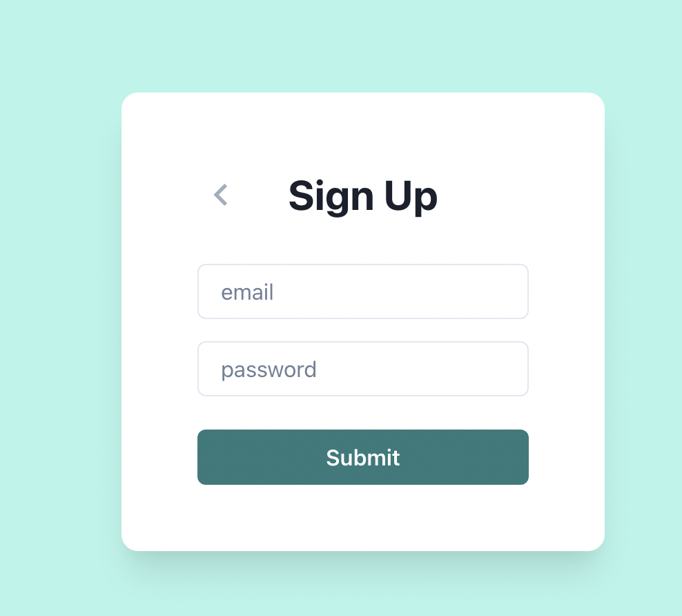

nestjs 공부 목적으로 간단한 로그인 페이지를 만들었다.

nestjs에 orm은 prisma로 postgres 썼고, 인증쪽은 passport-jwt 라이브러러리 사용했다.

느낀점은 개념을 알고나니 생각보다 생산성이 좋다. express보다 코드량이 늘어나서 개발속도가 느려지지 않을까 생각했었다. 하지만 nest의 필터, 가드 등의 개념들은 어차피 express에서도 구현했어야 하는 부분들이고, 오히려 nest cli 로 리소스 생성하는게 편해서 express보다 만족도가 높았다. 구조가 정해져 있으니 고민할게 적은 점도 장점이다.

프론트랑 백엔드 앱 두개를 같이 개발했는데 테스트를 짜는게 힘들다. 정확히는 백엔드에서 테스트코드를 작성하면서 api를 만들고 나서, 프론트 개발을 할때 어차피 서버에서 검증한 데이터라고 생각되어서 테스트를 짜는게 귀찮아진다. 그래서 위 레포에서는 프론트 테스트는 하나도 없다. 서버의 테스트와 중복되지 않는 의미있는 테스트만 작성하려면 어떻게 해야 할까

링크 - https://github.com/soso01/nestjs-study
